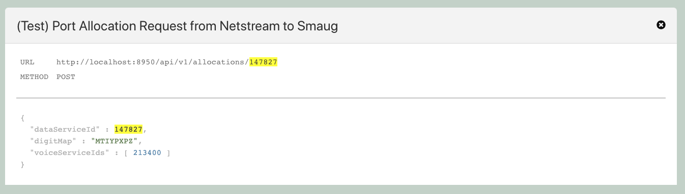
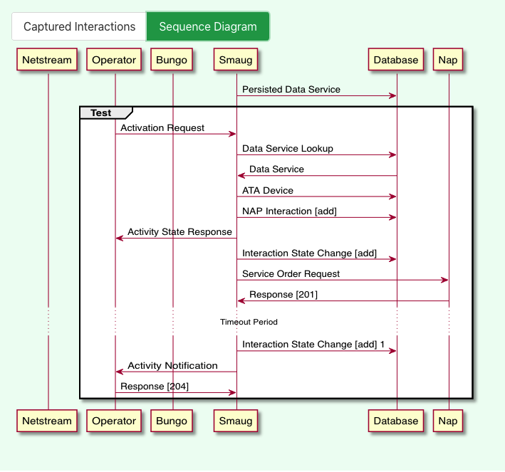

# Kensa
##Documentation

Kensa is an acceptance test tool which supports Java, Kotlin and JUnit5. Its artifacts reside within Artifactory under `seru-systems`.

The Kensa source code is on Gitlab, owned by Paul Brooks.

Team Sonique are maintainers and will happily merge pull requests.
<br />
Kotlin and Java are both fully supported as of version 105.
<br />
On request, Paul will make forking available.
### Dependency:
```
<dependency>
    <groupId>dev.kensa</groupId>
    <artifactId>kensa</artifactId>
    <version>105</version>
</dependency>
```
```
implementation("dev.kensa:kensa:105")
```

### Wiring Kensa into the application
Either add the following static initialiser to an existing application configuration class or create a standalone Kensa configuration class
(For reference Sonique has implemented this in ```<ApplicationName>Extension.java``` for RedQueen, Bran, Roobarb, Bullwinkle, Garibaldi and Doogal at time of writing)

`For Java`
```
class YourAppNameExtension implements org.junit.jupiter.api.extension.Extension {
static {
        Kensa.configure()
                .withAcronyms(
                        Acronym.of("SA", "some Acronym")
                )
                .withIssueTrackerUrl("https://cbsjira.bskyb.com/browse/")
                .withOutputStyle(MultiFile);
    }
}
```

`For Kotlin`
```
class YourAppNameExtension : org.junit.jupiter.api.extension.Extension {
    companion object {
        init {
            Kensa.konfigure {
                withAcronyms(
                        Acronym.of("SA", "some Acronym")
                )
                issueTrackerUrl = URL("https://cbsjira.bskyb.com/browse/")
                outputStyle = MultiFile
            }
        }
    }
}
```
This is a basic example of the configuration required for a simple application.<br />
```Acronym``` - Configuring acronyms is completely optional. They underline preconfigured words, which show the full definition on hover over.<br />
```IssueTrackerUrl``` - This adds hyperlinks for the story numbers annotated on a test, using the ```@Issue``` annotation.<br />
```OutputStyle``` - This sets the format for how Kensa generates the test files.<br /><br />
```ParameterizedTests``` are fully supported.
### Implementing Kensa in Acceptance Tests

Annotate the test class with the ```@ExtendWith``` annotation

`For Java:`
```
@ExtendWith(KensaConfiguritionClassName.class)
class MyTest implements JavaKensaTest, WithHamcrest {}
```
`For Kotlin:`
```
@ExtendWith(KensaConfiguritionClassName::class)
class MyTest : KotlinKensaTest, WithAssertJ {}
```

`JavaKensaTest` and `KotlinKensaTest` provide givens builders and actions under test
`WithHamcrest` and `WithAssertJ` provide state extractors

### Test Annotations of Interest

```@Issue```    replaces @Notes from Yatspec for story number display. It turns story numbers into a link to the related story/stories.<br />
```@Notes```    print comments, this works at method and class level.<br />
```@Highlight```     can be used on field declarations and highlight the field / field value in the test output.<br />
```@SentenceValue```    can be used on field declarations or parameter declarations and shows the field or variable value in the test output.<br />
```@Scenario```     enables you to replace the words of a method call with the return value of the method.<br />
```@NestedSentence```    collapses multiple assertions within a method and replaces them with a summary taken from the method name. On click the assertions made are visible.<br />
```@Emphasise```    emphasises text passages of interest. The annotation can be used for methods / functions or fields. Available text styles are `textStyles`, `textColor` and `backgroundColor`.<br />

`For Java:`
```
@Emphasise(textStyles = {dev.kensa.TextStyle.TextWeightBold, dev.kensa.TextStyle.TextDecorationUnderline}, backgroundColor = dev.kensa.Colour.TextPrimaryDark)
```
`For Kotlin:`
```
@Emphasise(textStyles = [dev.kensa.TextStyle.TextWeightBold, dev.kensa.TextStyle.TextDecorationUnderline], backgroundColor = [dev.kensa.Colour.BackgroundWarningLight])
```

### Request headers output
```showOnSequenceDiagram()``` is a `RenderableAttribute` and is set to `false` by default. Override to `true` to display a minimised table of the request url and the request method above the response body inside the UML modal



###Specify 'Time Passing' for timeouts etc
`interactions.captureTimePassing("Message")`<br />
`interactions.divider("Message")` is also available to give a double divider line in diagrams<br />
see Smaug's `KubernetesStub` and `BungoStub` on `git.bskyb.com` for implementations


