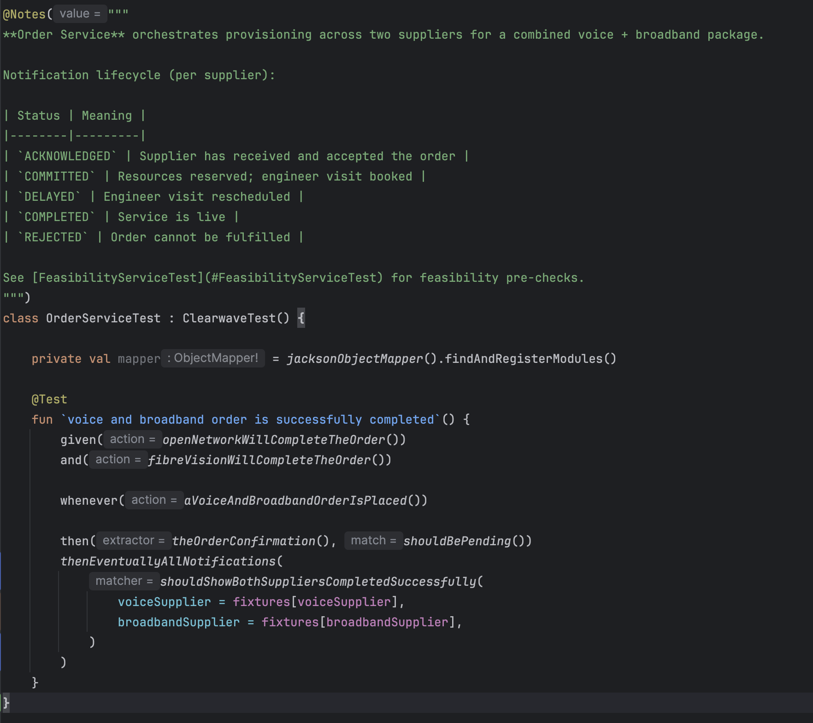
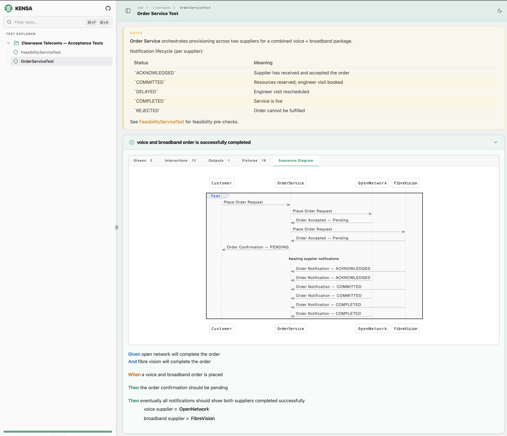

#  Kensa

 [](https://github.com/kensa-dev/kensa)

**Kensa** is a BDD testing framework for Kotlin and Java. Write Given-When-Then tests directly in code — no Gherkin files, no step definitions. Kensa parses your test source at runtime to produce rich HTML reports and sequence diagrams.

Check out the [documentation](https://kensa.dev) for quickstarts, API reference, and examples. See the [roadmap](https://kensa.dev/docs/roadmap) for what's coming in v0.7 and v0.8.

| Write this… | …get this |
|---|---|
|  |  |

## Features

- **Code-first BDD** — Given-When-Then structure in plain Kotlin/Java; no external DSL files
- **HTML reports** — generated directly from test source, always in sync with the code
- **Sequence diagrams** — visualise interactions between actors captured during test execution
- **Framework support** — JUnit 5 & 6, Kotest, TestNG
- **Assertion libraries** — Kotest, AssertJ, Hamcrest, HamKrest

## How Kensa Differs from Cucumber and JBehave

Cucumber and JBehave use Gherkin — a separate plain-text language where scenarios are written in `.feature` files and then mapped to test code via step definitions. This keeps non-technical stakeholders involved but introduces a permanent gap between the spec and the implementation: step glue code drifts, Gherkin files go stale, and reports reflect the spec rather than what the code actually does.

Kensa takes a different approach: tests are written entirely in Kotlin or Java, using a fluent Given-When-Then DSL. There are no feature files and no step definitions. The HTML report is generated by parsing the test source directly at runtime, so it is always an accurate reflection of the test as written.

Because everything is plain code, your IDE's refactoring tools work across the full test suite without any extra steps. Rename a method or parameter and the change propagates everywhere — including what appears in the HTML report. With Cucumber or JBehave, renaming a step definition leaves the `.feature` or `.story` files out of sync, breaking the mapping silently until the next test run.

|  | Kensa                     | Cucumber (JVM) | JBehave |
|--|---------------------------|----------------|---------|
| Test language | Kotlin / Java             | Gherkin + Java/Kotlin | Gherkin + Java |
| Step definitions | Not required              | Required | Required |
| Reports generated from | Live test source code     | Gherkin feature files | Gherkin story files |
| IDE refactoring support | Full — pure code, no external files | Partial — step definitions refactor but feature files don't | Partial — step definitions refactor but story files don't |
| Sequence diagrams | Built-in                  | Not built-in | Not built-in |
| Framework support | JUnit 5/6, Kotest, TestNG | JUnit 5, TestNG | JUnit, TestNG, Spring Test |

Kensa is the right fit if your team writes and owns the tests in code and wants reports that stay honest to what is actually being tested.

## Getting Started

Add the dependency for your test framework:

```kotlin
// build.gradle.kts
dependencies {
    testImplementation("dev.kensa:kensa-junit:<version>")   // JUnit 5 & 6
    // or
    testImplementation("dev.kensa:kensa-kotest:<version>")  // Kotest runner

    // Assertions bridge (pick one or more)
    testImplementation("dev.kensa:kensa-kotest:<version>")
    testImplementation("dev.kensa:kensa-assertj:<version>")
}
```

Find the latest version on the [releases page](https://github.com/kensa-dev/kensa/releases).

See the [Kotlin quickstart](https://kensa.dev/docs/quickstart/kotlin-quickstart) or [Java quickstart](https://kensa.dev/docs/quickstart/java-quickstart) for a full setup walkthrough.

## Tooling

### CLI — serve reports locally

Copy the wrapper script from [`cli/wrappers/`](https://github.com/kensa-dev/kensa/tree/master/cli/wrappers) into your project root (`kensa` for macOS/Linux, `kensa.bat` for Windows) and commit it. The wrapper auto-downloads and keeps the binary up to date from GitHub releases.

```bash
kensa --dir build/kensa-output
```

This starts a local HTTP server and opens your HTML reports in the browser. You can also define named folders in a `.kensa-properties` file — see the [CLI docs](https://kensa.dev/docs/cli) for details.

### IntelliJ Plugin — open reports from your IDE

Install the [Kensa plugin](https://plugins.jetbrains.com/plugin/31099) from the JetBrains Marketplace to open any Kensa report directly from IntelliJ IDEA — no hunting through the filesystem.

- Gutter icons on test functions
- Links in the test console output
- Test toolbar actions

### Claude Code skill — AI-assisted test review

Every release also ships `kensa-test.skill`, a [Claude Code](https://claude.ai/code) skill that reviews Kensa tests for idiomatic style, fluency violations, and best-practice patterns.

Install it once:

```bash
claude plugin install kensa-test.skill
```

Then invoke it in any Claude Code session:

```
/kensa-test review this test
```

The skill checks for fluent English in rendered test bodies, correct use of Fixtures and CapturedOutputs, semantic assertion naming, composable setup toolboxes, and the typed context/mixin pattern for multi-stub tests.
